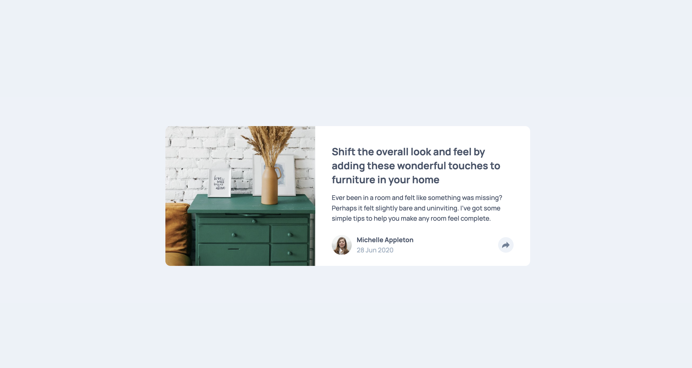
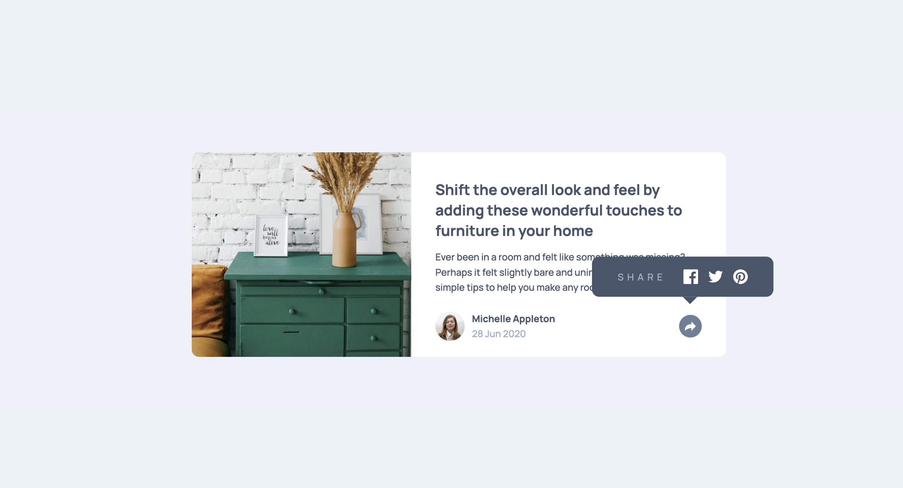
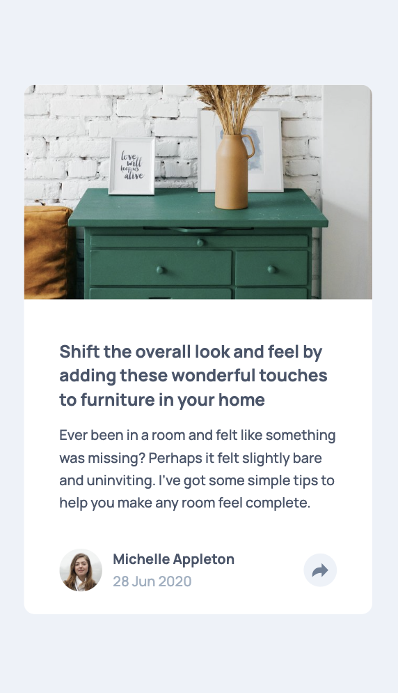
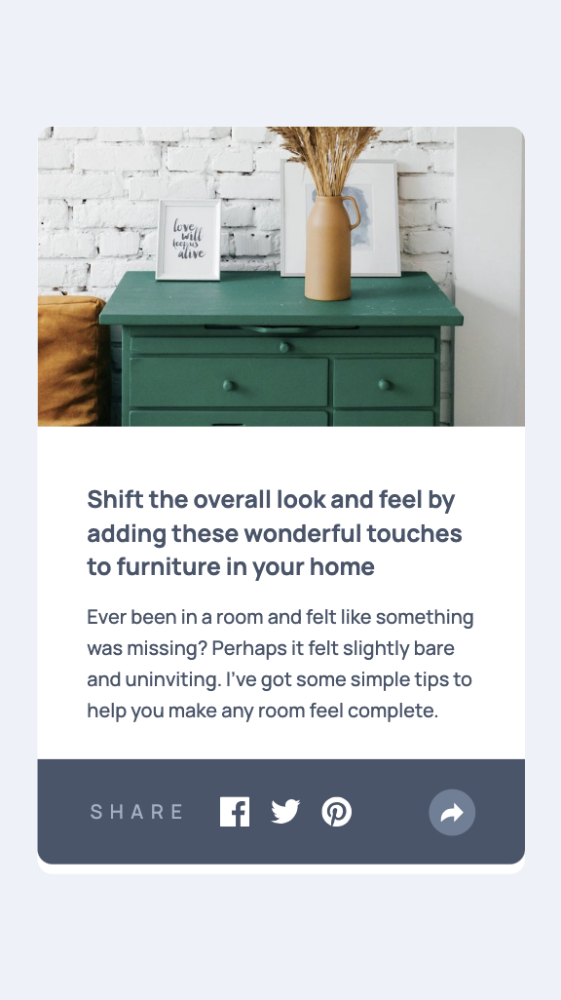

# Frontend Mentor - Article preview component solution

This is a solution to the [Article preview component challenge on Frontend Mentor](https://www.frontendmentor.io/challenges/article-preview-component-dYBN_pYFT). Frontend Mentor challenges help you improve your coding skills by building realistic projects. 

## Table of contents

- [Overview](#overview)
  - [The challenge](#the-challenge)
  - [Screenshot](#screenshot)
  - [Links](#links)
- [My process](#my-process)
  - [Built with](#built-with)
  - [What I learned](#what-i-learned)

## Overview

### The challenge

Users should be able to:

- View the optimal layout for the component depending on their device's screen size
- See the social media share links when they click the share icon

### Screenshot

### Links

- Solution URL: (https://github.com/Jack-OC/Article-Preview-Component)
- Live Site URL: (https://jack-oc.github.io/Article-Preview-Component/)

## My process

### Built with

- Semantic HTML5 markup
- CSS custom properties
- Flexbox
- CSS Grid
- Mobile-first workflow

### What I learned
From this challenge I gained more experience in creating webpages based on pre-made designs and using basic Javascript. This challenge was a simple article component that when the share button is clicked, a tooltip with links to social media pages pops up. To place the tooltip element where it is in the given designs I used the CSS position property. This was initially difficult, but after researching the property and testing it, I was more confident with position.  
